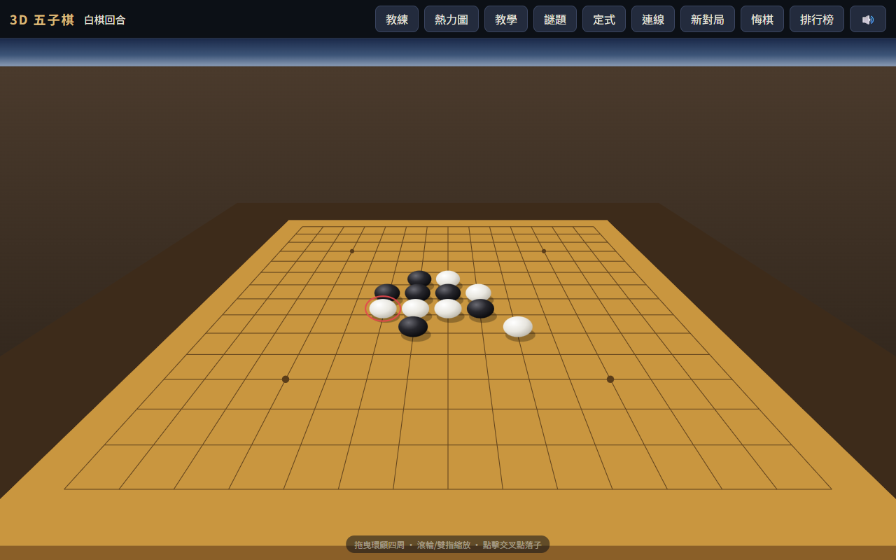

# 3D 五子棋 — 第一人稱對弈（強化 AI 版）

純 HTML + CSS + JavaScript + SVG 打造的 3D 五子棋，零依賴、零建置、零框架。
以第一人稱視角坐在棋桌前對弈，可拖曳環顧、縮放視角，支援雙人對戰與電腦對戰。

基於 [tonnychiulab/555](https://github.com/tonnychiulab/555)（MIT License）二次開發：
AI 升級為 **minimax + alpha-beta 剪枝深度搜尋（四段難度）**，並新增教學、殘局謎題、
開局定式圖鑑、AI 思考熱力圖、禁手規則、棋譜回放、線上對戰與霓虹開場等功能。



## 特色

- **純 SVG 3D 渲染** — 不用 WebGL、不用 Canvas、不用任何函式庫。自製透視相機（yaw/pitch 旋轉矩陣 + 透視除法）將棋盤、棋子投影成 SVG 圖形，棋子依深度排序繪製
- **第一人稱視角** — 拖曳環顧四周、滾輪或雙指縮放，像真的坐在棋桌前
- **雙人對戰 / 與電腦對戰** — 電腦強度四級：入門（單手啟發式＋隨機）、進階（2 層搜尋）、困難（6 層搜尋）、大師（1.5 秒時間預算迭代加深至 10 層）；核心採 negamax + alpha-beta 剪枝，搭配滑動五格窗盤面評估（能正確判斷 `X X _ X X` 等帶洞棋形），可選執黑或執白
- **線上對戰（WebRTC P2P）** — 和朋友直接連線對弈，零伺服器、不綁帳號：用任何聊天工具互傳「邀請碼／回應碼」即完成配對；落子、悔棋、新對局即時同步，斷線自動回單機（Google STUN 協助 NAT 穿透）
- **教學模式** — 分「新手技巧」（6 條大白話必勝技巧口訣）與「動手練習」（五個必勝殘局關卡：連五、活三變活四、雙活三、四三殺、雙四殺）；下錯自動退回重試、卡關可看提示，過關附棋理說明並記錄進度；每一關的必勝性經引擎搜尋驗證
- **殘局謎題（每日 + 練習）** — 依日期產生每天固定的殘局挑戰，三難度（入門1手／進階2手／高手3手）；每一題都經「引擎實際對打」驗證保證有解，下錯退回重試，每日破解狀態記錄
- **開局定式圖鑑** — 連珠 26 種標準開局（花月、浦月等），小型棋形預覽標手數＋理論評價，可從任一開局「你執黑」開始對弈
- **AI 思考熱力圖** — 一鍵顯示 AI 對每個候選點的評分（藍→紅），白環標出首選，看懂電腦怎麼想
- **教練模式與提示** — 對局中即時標出雙方威脅點（連五點、必擋點、雙威脅、活三，依急迫度過濾）；「提示」按鈕由 AI 建議下一手
- **禁手規則（可選）** — 正式五子棋規則：黑棋禁雙活三、雙四、長連（連五優先於禁手）；禁手點以 ✕ 標示、誤點會提示原因，AI 執黑也會避開
- **棋譜回放** — 對局結束後逐手回放整盤棋（按鈕或鍵盤 ←/→），檢討哪裡下錯
- **落子音效** — Web Audio 即時合成（落子、勝利、禁手音），不需音檔，可一鍵靜音
- **無限悔棋** — 悔到空盤為止；電腦模式一次退兩手；勝局悔棋可復活繼續下
- **電腦對電腦（觀戰模式）** — 黑棋是「大哥」：敗局已定時會閃白倒轉時間、悔棋改寫歷史（最多三次）；若仍被逼入絕境，天空轉為日出、對手棋子逃出棋盤，字幕宣告「大哥沒有輸！」（此模式維持原作的單手啟發式，保留戲劇平衡）
- **霓虹 Tron 開場動畫** — 首次進入播放 6 秒開場：深空黑底霓虹網格、能量脈衝方環、棋盤通電浮現，可隨時輕觸跳過
- **排行榜與親筆簽名** — 獲勝後可在簽名板上手寫簽名，連同名字、手數、用時存入 `localStorage`
- **多裝置支援** — Pointer Events 統一處理滑鼠與觸控，響應式排版，手機直接玩

## 本機執行

不需要安裝任何東西，直接用瀏覽器開啟 `index.html` 即可。

若想用本機伺服器：

```bash
npx serve .
# 或
python -m http.server 8000
```

## 操作方式

| 操作 | 桌面 | 行動裝置 |
|---|---|---|
| 落子 | 點擊交叉點 | 輕觸交叉點 |
| 環顧視角 | 按住拖曳 | 單指拖曳 |
| 縮放 | 滾輪 | 雙指開合 |
| 悔棋 | 「悔棋」按鈕或 `Ctrl+Z` / `U` | 「悔棋」按鈕 |

## AI 設計（本版強化重點）

`engine.js` 的 `aiMove(game, opts)`：

1. **一步決勝負捷徑** — 己方能連五直接下；對方下一手能連五直接擋，不進搜尋
2. **走法排序** — 對每個候選點（既有棋子 2 格內）以攻守合算的啟發式評分排序，每層只展開前 8 名（`BRANCH = 8`）
3. **negamax + alpha-beta** — 困難級 6 層（雙方各三手），能看穿「做雙活三」「四三殺」等組合攻擊；大師級用時間預算迭代加深（2→10 層、預設 1.5 秒）
4. **盤面評估** — 滑動五格窗：任一五格窗內只有單方棋子時依子數計分 `[0, 2, 40, 800, 20000, 10000000]`，開放棋形自然落在多個乾淨窗內而累積高分；對手同級威脅加權 ×1.15
5. **選項** — `opts.level`（`easy`/`medium`/`hard`/`master` 難度預設）、`opts.depth`（自訂深度，`0` = 原作的單手啟發式）、`opts.jitter`/`opts.pool`（隨機性，觀戰模式用）、`opts.timeBudget`/`opts.maxDepth`（迭代加深）

分析 API：`hints(game)` 威脅點分類（教練模式）、`analyzeMoves(game)` 候選點評分（熱力圖）、`forcedWin/forcedLoss(game, depth)` 必勝／必敗判定（教學關卡與謎題判題）、`forbiddenReason(board, x, y)` 禁手判定（Renju 簡化版）。

強度基準（`node tests/benchmark.js`，seeded 可重現）：搜尋版對原作啟發式（加隨機擾動）20 局 16 勝 0 敗 4 和，深度版單手思考最長約 0.5 秒。

## 測試

引擎、教學關卡、謎題產生器、定式資料皆可在 Node 直接測試（純邏輯，不需瀏覽器）：

```bash
node tests/engine.test.js    # 引擎單元測試（56 項：規則、禁手、難度、熱力圖評分、AI 強度）
node tests/lessons.test.js   # 教學關卡驗證（35 項：必勝性、正解、錯手判定）
node tests/puzzles.test.js   # 謎題產生器驗證（23 項：各難度合法、日期決定性、對打驗證）
node tests/openings.test.js  # 開局定式資料驗證（58 項：26 種座標自洽）
node tests/benchmark.js      # AI 強度基準（20 局 seeded 對弈）
```

UI 行為（難度選單、教學、謎題、定式、熱力圖、禁手、回放、霓虹開場、線上對戰）另以
Playwright + 系統 Edge 無頭瀏覽器做端對端測試（含兩瀏覽器真實 WebRTC 握手）。

`engine.js` 為 UMD 模組，也可直接在 Node 使用：

```js
const E = require('./engine.js');
const g = E.createGame();
E.place(g, 7, 7);
E.aiMove(g, { level: 'hard' }); // => { x, y }
```

## 專案結構

```
├── index.html            # 頁面結構、SVG 圖層與漸層定義、彈窗
├── style.css             # 版面與響應式樣式
├── engine.js             # 遊戲引擎：棋盤、勝負判定、悔棋、禁手、AI、分析 API（UMD）
├── lessons.js            # 教學：新手技巧小抄 + 五關必勝棋法（UMD）
├── openings.js           # 開局定式圖鑑資料：26 種連珠開局（UMD）
├── puzzles.js            # 殘局謎題產生器：日期決定性、對打驗證保證必勝（UMD）
├── online.js             # 線上對戰：WebRTC P2P 連線封裝
├── main.js               # 3D 投影、SVG 渲染、視角操作、各功能 UI、霓虹開場
├── tests/*.test.js       # Node 單元測試（engine/lessons/puzzles/openings）
├── tests/benchmark.js    # AI 強度基準測試
└── favicon.svg           # 網站圖示
```

## 授權

[MIT License](LICENSE) — 原作版權屬 tonnychiulab，本版修改依同授權釋出。
