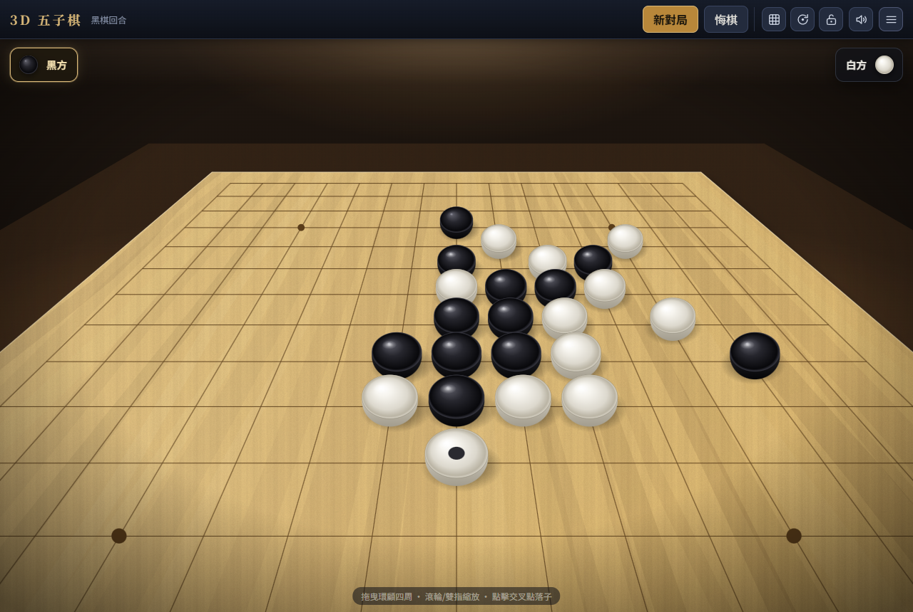
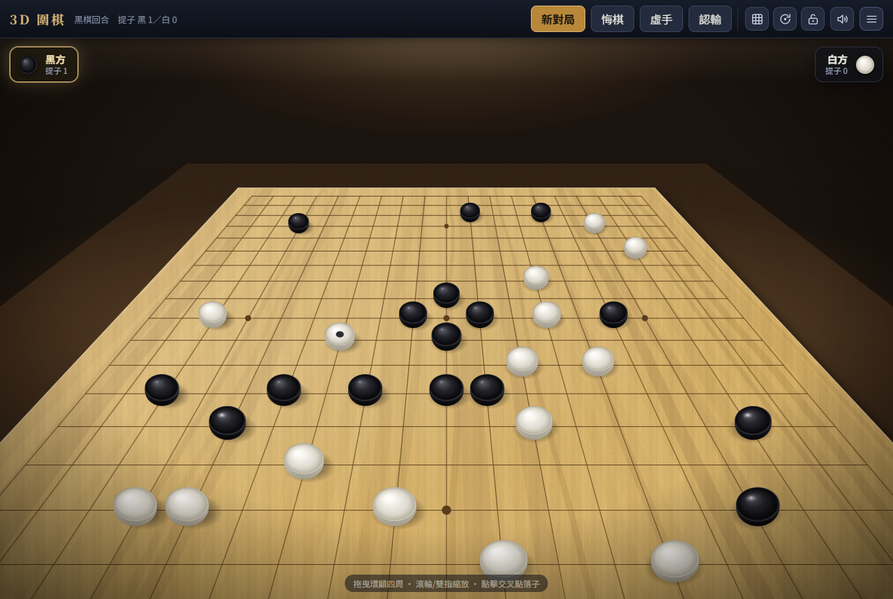

# 3D 棋弈 — 五子棋 × 圍棋

純 HTML + CSS + JavaScript + SVG 打造的 3D 棋盤遊戲，零依賴、零建置、零框架。
一站兩種棋：**五子棋**（minimax 深度搜尋 AI）與**圍棋**（9／13／19 路、MCTS 電腦對手、中國規則數子）。
以第一人稱視角坐在棋桌前對弈，可拖曳環顧、縮放視角，支援雙人對戰、電腦對戰與線上對戰。

基於 [tonnychiulab/555](https://github.com/tonnychiulab/555)（MIT License）二次開發：
先將五子棋 AI 升級為 minimax + alpha-beta 剪枝（四段難度），再把整個 UI 重構為棋種無關
（`GAMES` 設定表），新增完整的圍棋規則、蒙地卡羅樹搜尋 AI 與終局數子流程。

**線上遊玩：https://hbkqoo.github.io/gomoku/**




## 特色（兩種棋共通）

- **純 SVG 3D 渲染** — 不用 WebGL、不用 Canvas、不用任何函式庫。自製透視相機（yaw/pitch 旋轉矩陣 + 透視除法）將棋盤、棋子投影成 SVG 圖形，棋子依深度排序繪製；盤面大小可變（15 路五子棋、9/13/19 路圍棋），相機距離隨盤面自動調整
- **第一人稱視角** — 拖曳環顧四周、滾輪或雙指縮放，像真的坐在棋桌前
- **2D 俯視 / 回正 / 鎖定視角** — 「2D 視角」把相機搬到棋盤正上方，回到傳統平面棋盤；「⟲ 回正」一鍵還原角度與縮放；「🔓 鎖定視角」擋掉拖曳與縮放避免誤觸。狀態記在瀏覽器裡，下次開啟沿用
- **線上對戰（WebRTC P2P）** — 和朋友直接連線對弈，零伺服器、不綁帳號：用任何聊天工具互傳「邀請碼／回應碼」即完成配對。棋種與盤面以主機為準；落子、悔棋、虛手、認輸、死子確認、結算全程同步，斷線自動回單機（Google STUN 協助 NAT 穿透）
- **AI 思考熱力圖** — 一鍵顯示 AI 對每個候選點的評價（藍→紅），白環標出首選；圍棋版以 MCTS 訪問數分時計算，不凍結畫面
- **教練模式與提示** — 五子棋標出雙方威脅點（連五點、必擋點、雙威脅…）；圍棋標出叫吃層級的戰術（金＝可提子、粉紅＝我方剩一氣、紅＝逃氣點）；「提示」按鈕由 AI 建議下一手
- **教學模式** — 每棋種各有「觀念小抄」與「動手練習」關卡，下錯自動退回重試、卡關可看提示，過關進度分開記錄
- **棋譜回放** — 對局結束後逐手回放（按鈕或鍵盤 ←/→）；圍棋的回放按規則重演提子過程
- **排行榜與親筆簽名** — 獲勝後手寫簽名上榜；每棋種一份榜（圍棋記錄路數與目數差／中盤勝）
- **落子音效** — Web Audio 即時合成，不需音檔；**無限悔棋**（圍棋悔棋會還原被提的子與劫的狀態）；**多裝置支援**（Pointer Events 統一滑鼠與觸控，手機直接玩）

## 五子棋

- **四段電腦難度** — 入門（單手啟發式＋隨機）、進階（2 層搜尋）、困難（6 層搜尋）、大師（1.5 秒時間預算迭代加深至 10 層）；negamax + alpha-beta 剪枝、滑動五格窗盤面評估（能正確判斷 `X X _ X X` 等帶洞棋形）
- **殘局謎題（每日 + 練習）** — 依日期產生每天固定的挑戰，三難度；每一題經「引擎實際對打」驗證保證有解
- **開局定式圖鑑** — 連珠 26 種標準開局（花月、浦月等），可從任一開局「你執黑」開始對弈
- **禁手規則（可選）** — 黑棋禁雙活三、雙四、長連；禁手點以 ✕ 標示、AI 執黑也會避開
- **教學五關** — 連五、活三變活四、雙活三、四三殺、雙四殺；必勝性經引擎搜尋驗證
- **電腦對電腦（觀戰模式）** — 黑棋是「大哥」：敗局已定時閃白倒轉時間悔棋改寫歷史（最多三次），仍不敵則對手棋子逃出棋盤，字幕宣告「大哥沒有輸！」
- **霓虹 Tron 開場動畫** — 首次進入播放 6 秒，可隨時輕觸跳過

## 圍棋

- **完整規則** — 氣與提子、禁著點（自殺）、打劫（禁止立刻回提）、**位置超劫**（Zobrist 雜湊禁止重現先前盤面）、虛手；9／13／19 路三種盤面，中國規則、貼目 7.5 目
- **MCTS 電腦對手** — 蒙地卡羅樹搜尋（UCT）＋帶叫吃應對的隨機模擬，四段難度（入門數百盤模擬～大師每手約 4 秒）。內部用 union-find ＋「偽氣」法維護棋塊與氣，實測 9 路每秒約 5 萬盤模擬、19 路約 1.3 萬盤；搜尋以 requestAnimationFrame 分時執行，AI 思考時畫面不凍結。19 路受純網頁運算量所限，棋力以 9 路最佳
- **終局流程** — 雙方連續虛手 → 確認死子（自動判死當起點，**點任何一塊棋可切換死活**，比分即時更新、地盤即時著色）→ 中國規則數子（活子＋圍地＋貼目，結算面板列明細）；隨時可認輸。自動判死結合蒙地卡羅擁有率與兩條硬規則（兩眼無條件活；單一 ≤3 點眼位必死），複雜死活仍以手動修正為準
- **教學六關** — 氣與提子、逃出叫吃、雙叫吃、做出兩個眼、打劫（實際體驗劫的規則與劫材）、征子；每關的可解性與錯手判定經測試驗證
- **狀態列** — 即時顯示雙方提子數、對方虛手提醒、終局結果

## 本機執行

不需要安裝任何東西，直接用瀏覽器開啟 `index.html` 即可。

若想用本機伺服器：

```bash
npx serve .
# 或
python -m http.server 8000
```

## 操作方式

| 操作 | 桌面 | 行動裝置 |
|---|---|---|
| 落子 | 點擊交叉點 | 輕觸交叉點 |
| 環顧視角 | 按住拖曳 | 單指拖曳 |
| 縮放 | 滾輪 | 雙指開合 |
| 2D 俯視 / 回正 / 鎖定 | 「2D 視角」／「⟲ 回正」／「🔓 鎖定視角」按鈕 | 同左 |
| 悔棋 | 「悔棋」按鈕或 `Ctrl+Z` / `U` | 「悔棋」按鈕 |
| 虛手 / 認輸（圍棋） | 「虛手」／「認輸」按鈕 | 同左 |
| 確認死子（圍棋終局） | 點棋子切換死活 → 「確認結算」 | 同左 |

## AI 設計

### 五子棋（`engine.js`）

1. **一步決勝負捷徑** — 己方能連五直接下；對方下一手能連五直接擋，不進搜尋
2. **走法排序** — 對每個候選點以攻守合算的啟發式評分排序，每層只展開前 8 名
3. **negamax + alpha-beta** — 困難級 6 層；大師級用時間預算迭代加深（2→10 層）
4. **盤面評估** — 滑動五格窗依子數計分，開放棋形自然累積高分；對手同級威脅加權 ×1.15

分析 API：`hints`（教練）、`analyzeMoves`（熱力圖）、`forcedWin/forcedLoss`（教學判題）、`forbiddenReason`（禁手）。

### 圍棋（`go.js` + `go-ai.js`）

- `go.js`：規則引擎。棋塊與氣用 flood fill、超劫用雙 32 位元 Zobrist 雜湊、
  中國規則數子（死子可外部指定）、棋譜重播按規則重演
- `go-ai.js`：高速盤面（union-find + 偽氣三累加量，叫吃判定 O(1)）、
  UCT 樹搜尋＋先驗（提子/救子/位置）、模擬帶叫吃應對（提掉被叫吃的敵塊、
  救出被叫吃的我方棋塊），可分時執行（`createSearch().step(ms)`）；
  `guessDead` 以多盤模擬統計每點歸屬，供終局自動判死

## 測試

引擎、AI、教學關卡、謎題產生器、定式資料皆可在 Node 直接測試（純邏輯，不需瀏覽器）：

```bash
node tests/engine.test.js      # 五子棋引擎（56 項：規則、禁手、難度、AI 強度）
node tests/difficulty.test.js  # 五子棋難度分級（8 項）
node tests/go.test.js          # 圍棋規則引擎（132 項：氣、提子、劫、超劫、虛手、數子）
node tests/go-ai.test.js       # 圍棋 AI（95 項：高速盤面與規則引擎逐手交叉比對、戰術、死活、棋力）
node tests/go-lessons.test.js  # 圍棋教學關卡（67 項：可解性、錯手判定、征子全程）
node tests/lessons.test.js     # 五子棋教學關卡（35 項）
node tests/puzzles.test.js     # 謎題產生器（23 項）
node tests/openings.test.js    # 開局定式資料（58 項）
node tests/benchmark.js        # 五子棋 AI 強度基準（20 局 seeded 對弈）
```

UI 行為（棋種切換、教學、謎題、熱力圖、終局數子、回放、線上對戰）另以
Playwright 無頭瀏覽器做端對端測試（含兩分頁真實 WebRTC 握手、圍棋終局全流程）。

引擎皆為 UMD 模組，可直接在 Node 使用：

```js
const Go = require('./go.js');
const AI = require('./go-ai.js');
const g = Go.createGame({ size: 9 });
Go.place(g, 4, 4);
AI.aiMove(g, { level: 'hard' }); // => { x, y } 或 { pass: true }
```

## 專案結構

```
├── index.html            # 頁面結構、SVG 圖層與漸層定義、彈窗
├── style.css             # 版面與響應式樣式
├── main.js               # 棋種無關 UI：GAMES 設定表、3D 投影、SVG 渲染、視角、終局流程、線上對戰
├── engine.js             # 五子棋引擎：規則、禁手、minimax AI、分析 API（UMD）
├── go.js                 # 圍棋規則引擎：氣、提子、劫、超劫、虛手、中國規則數子（UMD）
├── go-ai.js              # 圍棋 AI：union-find 高速盤面、MCTS（UCT）、死活判定（UMD）
├── go-lessons.js         # 圍棋教學：六關劇本 + 觀念小抄（UMD）
├── lessons.js            # 五子棋教學：五關必勝棋法 + 技巧小抄（UMD）
├── openings.js           # 五子棋開局定式圖鑑：26 種連珠開局（UMD）
├── puzzles.js            # 五子棋殘局謎題產生器（UMD）
├── online.js             # 線上對戰：WebRTC P2P 連線封裝
├── tests/*.test.js       # Node 單元測試（見上方測試清單）
├── tests/benchmark.js    # 五子棋 AI 強度基準測試
└── favicon.svg           # 網站圖示
```

## 授權

[MIT License](LICENSE) — 原作版權屬 tonnychiulab，本版修改依同授權釋出。
